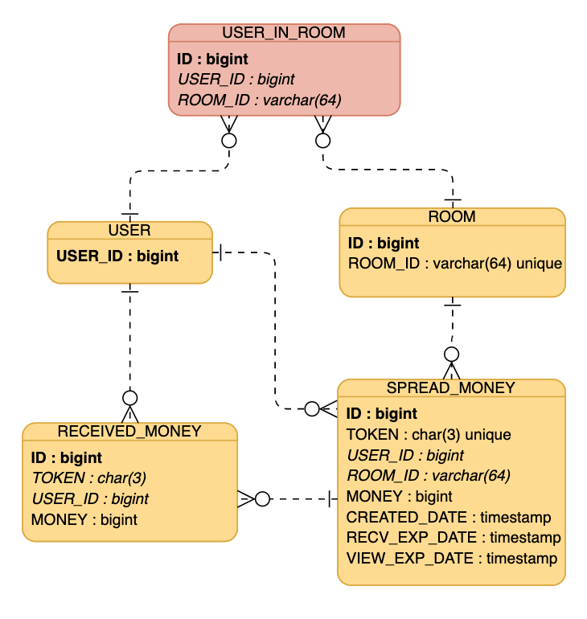

# money-api
## API 소개
- 사용자는 다수의 친구들이 있는 대화방에서 뿌릴 금액과 받아갈 대상의 숫자를 입력하여 뿌리기 요청을 보낼 수 있습니다.
- 요청 시 자신의 잔액이 감소되고 대화방에는 뿌리기 메세지가 발송됩니다.
- 대화방에 있는 다른 사용자들은 위에 발송된 메세지를 클릭하여 금액을 무작위로 받아가게 됩니다.

## 개발 환경
- Java 8
- Spring Boot 2.3.1.RELEASE
- Gradle 6.6.1
- H2 1.4.200
- Spring Data JPA
- JUnit4

## 문제해결 전략
### 공통
- 헤더의 유효성을 검사하는 중복 코드 제거를 위해 HeaderInterceptor 추가하여 인터셉트 처리
- money-api에서 발생할 수 있는 에러 처리를 위해 커스텀 Exception 추가하고 Enum으로 에러코드 관리

### 뿌리기 API
- 사용자와 대화방의 DB 조회와 데이터 검증 후, 토큰과 뿌리기 이벤트 생성
- 토큰은 1-9, a-z, A-Z의 순서와 값을 랜덤으로 뽑아 생성
  - 추후 토큰 발급 방법 변경 시 용이하도록 Strategy 패턴 적용
- SPREAD_MONEY 테이블에 유일한 토큰값 저장
  - DB 필드에 UNIQUE 지정
  - Spring retry 의존성 추가하여 @Retryable 사용(중복 시 1회 재시도)

### 받기 API
- (총 뿌리기 금액 - 현재까지 받은 금액)과 (총 인원 - 현재까지 받은 인원)으로 금액 분배
  - 추후 분배 방법 변경 시 용이하도록 Strategy 패턴 적용
  - 동등 분배, 랜덤 분배 전략 보유
- 기존에 뿌리기 레코드 생성 시 미리 금액을 분배하여 DB에 저장해두고, 받기 요청 시 업데이트 처리하도록 설계했으나 수정
  - 위 방법 적용 시 받기 인원이 10만 명이라면 10만 개의 레코드를 한 번에 삽입처리하게 되고, 받지 않는 사용자로 인해 불필요한 데이터 보관
  - 따라서, 뿌리기 API 호출 시에는 뿌리기 데이터만 추가하고, 받기 API 호출 시 금액 분배하고 데이터 추가하도록 변경 

### 조회 API
- 오직 조회만 하는 API이기 때문에 트랜잭션 readOnly 설정

## REST API
### 뿌리기 API
- **Request**
  - URL
    ```
    POST /money/spread
    Content-Type: application/json
    X-USER-ID: 사용자 아이디
    X-ROOM-ID: 대화방 아이디
    ```
    
  - Parameter
    
    |이름|타입|설명|필수값|
    |---|---|---|-----|
    |money|BigDecimal|뿌리기할 총 금액|Y|
    |headCount|Long|뿌리기할 인원|Y|

- **Response**
  - Key
    
    |이름|타입|설명|
    |---|---|---|
    |token|String|뿌리기 건 고유 값|
    
  - Error Message
  
    |이름|code|설명|
    |---|---|---|
    |NotExistRoom|4000|존재하지 않는 대화방입니다.|
    |NotExistUser|4001|존재하지 않는 사용자입니다.|
    |NotExistUserInRoom|4002|대화방에 존재하지 않는 사용자입니다.|
    |OverHeadCount|4003|받을 인원은 본인을 제외한 대화방 인원 수를 초과할 수 없습니다.|
    |MinimumMoney|4004|뿌릴 금액은 최소 1000원부터 가능합니다.|

- **Sample**
  - Request
    ```
    POST http://localhost:8080/money/spread
    Content-Type: application/json
    X-USER-ID: 10001
    X-ROOM-ID: ROOM1
    
    {
      "money": 50000,
      "headCount": 2
    }
    ```
  - Response
    ```
    HTTP/1.1 200 
    Content-Type: application/json
    {
      "token": "D4R"
    }
    ```

### 받기 API
- **Request**
  - URL
    ```
    PUT /money/spread/{token}
    X-USER-ID: 사용자 아이디
    X-ROOM-ID: 대화방 아이디
    ```
    
  - Parameter
    
    |이름|타입|설명|필수값|
    |---|---|---|-----|
    |token|String|뿌리기 생성 시 발급된 token|Y|
    
- **Response**
  - Key
    
    |이름|타입|설명|
    |---|---|---|
    |money|BigDecimal|받은 금액|
    
  - Error Message
  
    |이름|code|설명|
    |---|---|---|
    |NotExistRoom|4000|존재하지 않는 대화방입니다.|
    |NotExistUser|4001|존재하지 않는 사용자입니다.|
    |NotExistUserInRoom|4002|대화방에 존재하지 않는 사용자입니다.|
    |SpreadUser|4005|뿌리기한 사용자는 머니를 받을 수 없습니다.|
    |AlreadyReceivedUser|4006|이미 머니를 받은 사용자입니다.|
    |AlreadyAllReceived|4007|받기 가능 제한 인원이 초과되었습니다.|
    |ExpireReceiveDate|4008|요청하신 뿌리기 건의 받기 기한이 만료되었습니다.|

- **Sample**
  - Request
    ```
    PUT http://localhost:8080/money/spread/D4R
    X-USER-ID: 10003
    X-ROOM-ID: ROOM1
    ```
  - Response: success
    ```
    HTTP/1.1 200 
    Content-Type: application/json
    {
      "money": 25000.00
    }
    ```
  - Response: fail
    ```
    HTTP/1.1 400 
    Content-Type: application/json
    {
      "code": 4005,
      "message": "이미 머니를 받은 사용자입니다."
    }
    ```
  
### 조회 API
- **Request**
  - URL
    ```
    GET /money/spread/{token}
    X-USER-ID: 사용자 아이디
    X-ROOM-ID: 대화방 아이디
    ```
    
  - Parameter
    
    |이름|타입|설명|필수값|
    |---|---|---|-----|
    |token|String|뿌리기 생성 시 발급된 token|Y|
    
- **Response**
  - Key
    
    |이름|타입|설명|
    |---|---|---|
    |createdDate|LocalDateTime|뿌리기 생성일시|
    |money|BigDecimal|뿌리기 총 금액|
    |receivedMoney|BigDecimal|현재까지 받은 금액|
    |receivedInfo|List|받은 정보|
    | ㄴ userId|Long|받은 사용자 아이디|
    | ㄴ money|BigDecimal|받은 금액|
    
  - Error Message
  
    |이름|code|설명|
    |---|---|---|
    |NotExistRoom|4000|존재하지 않는 대화방입니다.|
    |NotExistUser|4001|존재하지 않는 사용자입니다.|
    |NotExistUserInRoom|4002|대화방에 존재하지 않는 사용자입니다.|
    |ExpireViewDate|4009|요청하신 뿌리기 건의 조회 기한이 만료되었습니다.|
    |NotSpreadUser|4010|뿌리기한 사용자만 조회 가능합니다.|

- **Sample**
  - Request
    ```
    GET http://localhost:8080/money/spread/D4R
    X-USER-ID: 10001
    X-ROOM-ID: ROOM1
    ```
  - Response
    ```
    HTTP/1.1 200 
    Content-Type: application/json
    {
      "createdDate": "2020-11-23T06:29:32.318",
      "money": 50000.00,
      "receivedMoney": 25000.00,
      "receivedInfo": [
      {
        "userId": 10003,
        "money": 25000.00
      }
      ]
    }
    ```

### 그 외 Error Message

  |이름|code|설명|
  |---|---|---|
  |MissingHeader|4011|필수 데이터가 누락되었습니다.|
  |InternalError|5000|일시적인 오류가 발생했습니다. 잠시 후 다시 시도해주세요.|


## DB 설계
### ERD



### SCHEMA
```mysql
CREATE TABLE USER (
    USER_ID     BIGINT      PRIMARY KEY
);

CREATE TABLE ROOM (
    ID          BIGINT      PRIMARY KEY ,
    ROOM_ID     VARCHAR(64)
);

CREATE TABLE USER_IN_ROOM (
    ID          BIGINT      PRIMARY KEY ,
    USER_ID     BIGINT      NOT NULL ,
    ROOM_ID     VARCHAR(64) NOT NULL
);

ALTER TABLE USER_IN_ROOM
ADD FOREIGN KEY (USER_ID) REFERENCES USER(USER_ID);

ALTER TABLE USER_IN_ROOM
ADD FOREIGN KEY (ROOM_ID) REFERENCES ROOM(ROOM_ID);

CREATE TABLE SPREAD_MONEY (
    ID              BIGINT      AUTO_INCREMENT  PRIMARY KEY ,
    TOKEN           CHAR(3)     UNIQUE          NOT NULL,
    USER_ID         BIGINT      NOT NULL ,
    ROOM_ID         VARCHAR(64) NOT NULL ,
    MONEY           BIGINT      NOT NULL ,
    CREATED_DATE    TIMESTAMP   DEFAULT NOW()   NOT NULL ,
    RECV_EXP_DATE   TIMESTAMP   NOT NULL ,
    VIEW_EXP_DATE   TIMESTAMP   NOT NULL
);

ALTER TABLE SPREAD_MONEY
    ADD FOREIGN KEY (USER_ID) REFERENCES USER(USER_ID);

ALTER TABLE SPREAD_MONEY
    ADD FOREIGN KEY (ROOM_ID) REFERENCES ROOM(ROOM_ID);

CREATE TABLE RECEIVED_MONEY (
    ID              BIGINT      AUTO_INCREMENT  PRIMARY KEY ,
    TOKEN           CHAR(3)     NOT NULL ,
    USER_ID         BIGINT      NOT NULL ,
    MONEY           BIGINT      NOT NULL 
);

ALTER TABLE RECEIVED_MONEY
    ADD FOREIGN KEY (TOKEN) REFERENCES SPREAD_MONEY(TOKEN);

ALTER TABLE RECEIVED_MONEY
    ADD FOREIGN KEY (USER_ID) REFERENCES USER(USER_ID);
```

### 개선할 점
- 서비스 레이어 로직 분리
- 테스트 코드 개선
